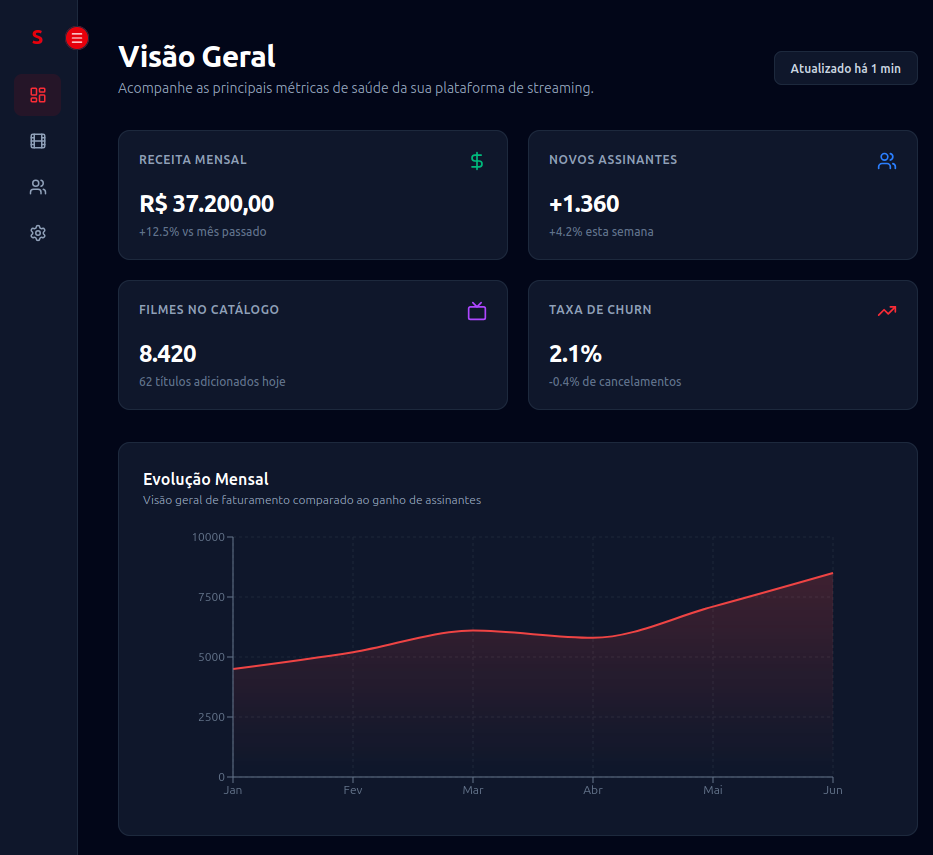
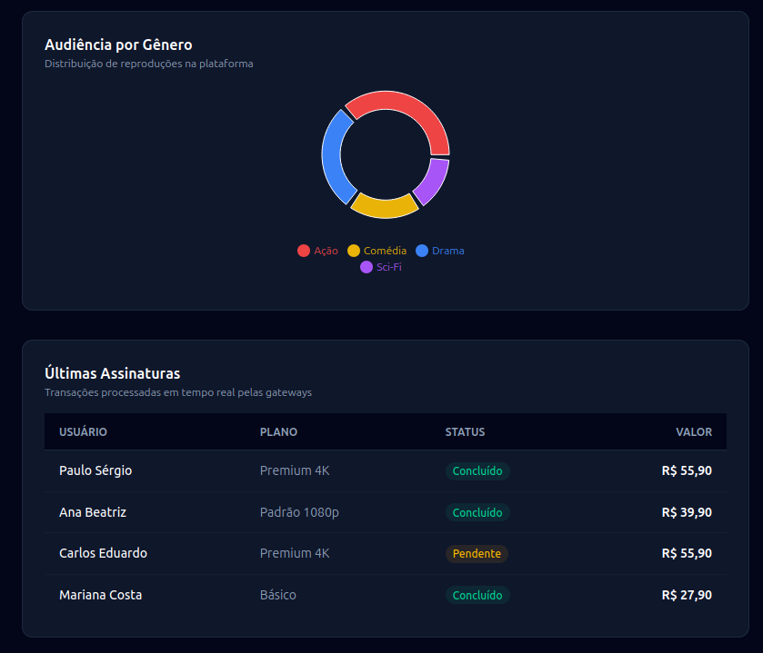

# 📈 StreamBI - Admin Dashboard

[🇺🇸 English](./README.md) \| [🇧🇷 Português](./README.pt-br.md)

A modern, responsive administrative dashboard application built with
**Next.js 16**, **React 19**, **Tailwind CSS v4**, and **Recharts**.

## 📸 Demo

<p align="center">


</p>

------------------------------------------------------------------------

## ✨ Features

-   📊 Dynamic data visualization (Area and Pie Charts) with Recharts.
-   📱 Smart auto-collapsing sidebar using a hybrid CSS + JavaScript
    approach.
-   💰 Recent subscriptions table with conditional status badges.
-   ⚡ Next.js 16 App Router with Turbopack.
-   🎨 Responsive UI built with Tailwind CSS v4.
-   🔄 Proper Client Components usage for interactive charts.

------------------------------------------------------------------------

## 🛠️ Technologies

-   Next.js 16 (App Router)
-   React 19
-   TypeScript
-   Tailwind CSS v4
-   Recharts 3
-   Lucide React
-   Yarn

------------------------------------------------------------------------

## 📂 Project Structure

``` text
src/
├── app/
│   ├── globals.css
│   ├── layout.tsx
│   └── page.tsx
├── components/
│   ├── DashboardCharts.tsx
│   └── Sidebar.tsx
├── mock/
│   └── dashboardData.ts
```

------------------------------------------------------------------------

## 💡 Technical Concepts

### Client vs. Server Components

Interactive charts are isolated into Client Components using
`"use client"` to ensure browser-side rendering where DOM measurements
are required.

### Hybrid Responsiveness (CSS + JavaScript)

Besides Tailwind responsive utilities, the sidebar automatically
collapses based on the current viewport width using a resize listener.

``` tsx
useEffect(() => {
  const handleResize = () => {
    setIsCollapsed(window.innerWidth < 1024);
  };

  handleResize();

  window.addEventListener("resize", handleResize);

  return () =>
    window.removeEventListener("resize", handleResize);
}, []);
```

### Data Visualization

The dashboard uses Recharts to display interactive Area and Pie charts
with custom gradients, legends and tooltips.

### Responsive Design

The interface follows a mobile-first strategy using CSS Grid and
Flexbox, adapting KPI cards, charts and tables across different screen
sizes.

------------------------------------------------------------------------

## 🚀 Getting Started

### Clone

``` bash
git clone https://github.com/paullo-ps/dashboard.git
```

### Enter the project

``` bash
cd dashboard
```

### Install dependencies

Using npm

``` bash
npm install
```

Using Yarn

``` bash
yarn
```

### Run

Using npm

``` bash
npm run dev
```

Using Yarn

``` bash
yarn dev
```

Open:

``` text
http://localhost:3000
```

------------------------------------------------------------------------

## 📚 What I Learned

-   Next.js 16 App Router.
-   React 19 ecosystem.
-   Tailwind CSS v4.
-   Component-based architecture.
-   Responsive dashboard layouts.
-   Recharts data visualization.
-   TypeScript for scalable applications.
-   Hybrid responsive UX.

------------------------------------------------------------------------

## 🔮 Future Improvements

-   REST API integration.
-   GraphQL support.
-   Authentication.
-   Dark/Light theme.
-   Date filters.
-   Real-time updates.
-   User management.

------------------------------------------------------------------------

## 👨‍💻 Author

**Paulo Sérgio Mendes dos Santos**

GitHub: https://github.com/paullo-ps

LinkedIn:
https://www.linkedin.com/in/paulo-s%C3%A9rgio-mendes-dos-santos-914a29200